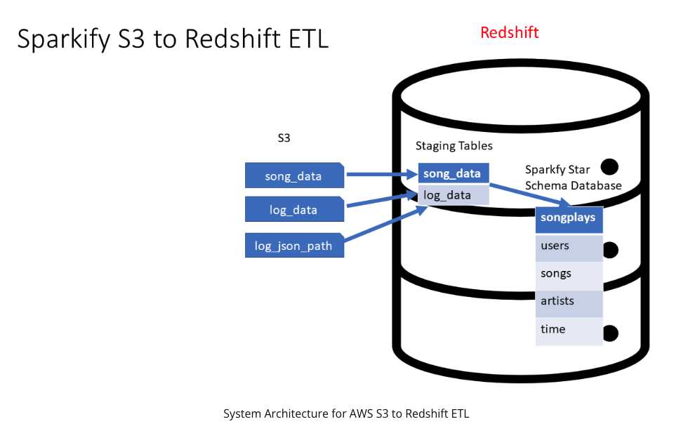
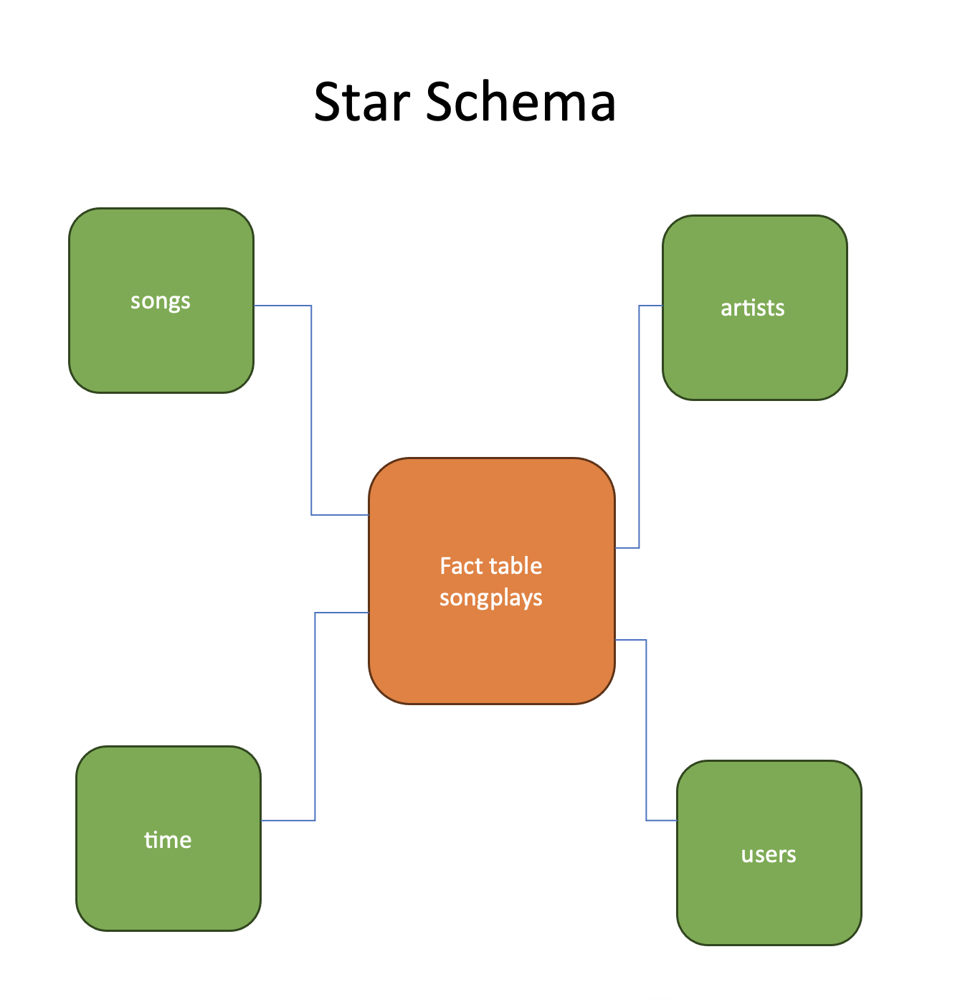
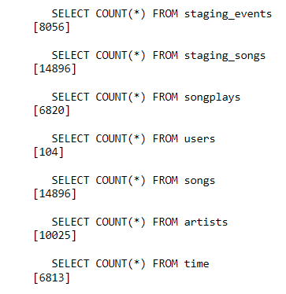

# de-udacity-nanodegree-project-03

# Project: Data Warehouse

# 1. The story

A music streaming startup, Sparkify, has grown their user base and song database and want to move their processes and data onto the cloud. Their data resides in S3, in a directory of JSON logs on user activity on the app, as well as a directory with JSON metadata on the songs in their app.

As their data engineer, you are tasked with building an ETL pipeline that extracts their data from S3, stages them in Redshift, and transforms data into a set of dimensional tables for their analytics team to continue finding insights into what songs their users are listening to.



# 2. Project Installation

The first step is to download or clone this Project repo.

You need to have `git` installed to clone this repo. Please follow this [link](https://git-scm.com/downloads) for installation instructions depending on your OS.

Cloning via HTTPS

```bash
$ git clone https://github.com/marcusreaiche/de-udacity-nanodegree-project-03.git
```

Cloning via SSH

```bash
$ git clone git@github.com:marcusreaiche/de-udacity-nanodegree-project-03.git
```

## 2.1 Python environment

We use `miniconda3` to define the Python environment. Please visit this [link](https://docs.conda.io/projects/miniconda/en/latest/miniconda-install.html) for installation instructions.

The `conda.yml` file lists the Project dependencies

```yaml
name: data-warehouse
channels:
  - conda-forge
  - defaults
dependencies:
  - python=3.9.18
  - pandas=2.1.1
  - awswrangler=3.4.1
  - boto3=1.28.70
  - botocore=1.31.70
  - jupyter=1.0.0
  - sqlalchemy=1.4.49
  - psycopg2=2.9.7
  - psycopg2-binary=2.9.7
  - ipython-sql=0.3.9
  - pip
  - pip:
    - python-dotenv==1.0.0
```

Run the following command to create a conda environment.

```bash
$ conda env create -f conda.yml
```

Then, activate it by running:

```bash
$ conda activate data-warehouse
```

## 2.2 AWS Setup

You need an AWS account to run this Project.

When using `boto3`, the AWS credentials and config files are automatically lookep up in the directory:

```
~/.aws
```

You can define environment variables in the `.env` file to change the default location of these files. See an example in the `example.env` file.

Note that a `.env` file will be automatically created in case you do not create one in the project root directory. In this case, the environment variables will be automatically set to their default values:

```
AWS_SHARED_CREDENTIALS_FILE=~/.aws/credentials
AWS_CONFIG_FILE=~/.aws/config
```

It is better to explicitly create a `.env` file in the project root, though. For performance resons, it is also recommended to set the region value in the AWS config file to 'us-west-2'. The reason for that is that this is the same region of the S3 resources used in this Project.

Here is an example of an AWS credentials file:

```
[default]
aws_access_key_id = <your AWS access key ID>
aws_secret_access_key = <your AWS secret access key>
```

and of an AWS config file:

```
[default]
region = us-west-2
output = json
```

# 3. Project Structure

Project directory tree

```
├── LICENSE
├── README.md
├── conda.yml
├── config.py
├── create_redshift_cluster.py
├── create_tables.py
├── delete_redshift_cluster.py
├── dwh.cfg
├── etl.py
├── example.env
├── execute_example_queries.py
├── imgs
│   └── sparkify.png
├── run_pipeline.py
├── sql_queries.py
└── utils
    ├── __init__.py
    ├── helpers.py
    └── manage_aws_resources.py
```

## 3.1 Scripts

The Project has 5 scripts:

- create_redshift_cluster.py
  > Creates a Redshift cluster as specified in the `dwh.cfg` file. It also creates an IAM role used by the Redshift cluster. This script dynamically fills in the `db_host` and the `arn` keys, respectively, of the `CLUSTER_CREDENTIALS` and `IAM_ROLE` sections in the `dwh.cfg` file.

- create_tables.py
  > Creates staging tables, i.e., `staging_events` and `staging_songs`. Creates a star schema with the fact table `songplays` and the dimension tables `users`, `songs`, `artists`, and `time`. Before creating these tables, the script deletes any of them if they exist.

- etl.py
  > Perform ETL by loading staging tables and doing insertions in the star schema tables.

- analytics_queries.py
  > Execute examples of analytics queries that one would like to do in the Data Warehouse.

- delete_redshift_cluster.py
  > Delete the Redshift cluster and the IAM role.

Please check the scripts doc strings for more information.

## 5.2 `sql_queries.py` module

Define all the SQL queries of the Project.

## 5.3 The config file

The `dwh.cfg` file sets the Project configuration. It has four sections:

- CLUSTER_CREDENTIALS
  > Defines the necessary variables to create and connect to the Redshift cluster.
- CLUSTER_INFRA
  > Defines the cluster type (`multi-node` or `single-node`), the node type, and the number of nodes.
- IAM_ROLE
  > Defines the name of the IAM_ROLE
- S3
  > Defines the S3 paths to the logs and songs data. It also defines the log json path.

Have a look at [dwh.cfg](dwh.cfg).

We also implemented the `Config` class in the `config` module (see `config.py`) to make it easier to interact with the Project configuration.

## 5.4 The `utils` subpackage

```
utils
├── __init__.py
├── helpers.py
└── manage_aws_resources.py
```

- `utils.helpers.py`
  > Helper functions used in the Project.

- `utils.manage_aws_resources.py`
  > Functions that help manage, create, and delete AWS resources.

Please check the modules' doc strings for more information.

## 5.5 Other files

Other files that compose the Project are:
- example.env
- .gitignore
- LICENSE
- .editorconfig

# 4. Running the Scripts

Any script can be run like

```bash
$ python <script_name>.py
```

However, one needs only to execute the `run_pipeline` script in order to execute any combination of scripts. This script has the optional argument `--steps` that allows the specification of which steps will be run.

> Steps
> 1. create_redshift_cluster
> 2. create_tables
> 3. etl
> 4. analytics_queries
> 5. delete_redshift_cluster

By default all steps are run when executing:

```bash
$ python run_pipeline.py
```

To execute steps 1 to 4, just run:

```bash
$ python run_pipeline.py --steps 1,2,3,4
```

This will not delete the Redshift cluster.

If one wants to create and delete the Redshift cluster, just run:

```bash
$ python run_pipeline.py --steps 1,5
```

The order of the steps matter and each comma-separated step is run one after the other.

# 5. Data Wareshouse - The Songs Database

## 5.1 Purpose

The purpose of the data warehouse is to clean, preprocess, and prepare Sparkify's log data to be analyzed by the company's analytics team in an efficient way. This task is performed taking into consideration optimization for analytics queries instead of transactional ones. In this regard, a star schema was designed with a fact table being surrounded by dimension tables. In this way, we avoid performing deep and complicated joins to fetch the data since it is not presented in 3NF. Another advantage is not performing big analytics queries over the OLTP database to avoid overloading the transactional system.

## 5.2 Database Schema Design

The songs database follows a star schema with a fact table, songplays, surrounded by dimension tables.

Fact table
- songplays
  > records in event data associated with song plays, i.e., records with page `NextSong`
  > - songplay_id, start_time, user_id, level, song_id, artist_id, session_id, location, user_agent

Dimension tables
- users:
  > users in the app
  > - user_id, first_name, last_name, gender, level
- songs
  > songs in the music database
  > - song_id, title, artist_id, year, duration
- artists
  > artists in music database
  > - artists_id, name, location, latitude, longitude
- time
  > timestamp of records in songplays broken down into specific units
  > - start_time, hour, day, week, month, year, weekday

In this way, the analytics team can intuitively and easily create and run efficient queries against the database.



## 5.3 Example of Analytical Queries

In the script `analytics_queries.py` a few examples of analytics queries are presented. Run the script to answer the questions listed in the sequel.

### 5.3.1 Count the Total Number of Rows for Each Table

This is done mostly for checking purposes.

The following result is expected:



### 5.3.2 Users Queries

We want to answer the following questions:

- What is the users distribution by gender?
- What is the users distribution by level (free/paid)?

The last question is particularly interesting since we discover that there are many more free users than paid users in the app.

### 5.3.3 Song Plays Queries

We want to answer the following questions:

- What is the number of song plays distribution by user level?
- What is the number of song plays distribution by hour?

Even though there are almost four times more free users than paid ones, the latter group is responsible for playing more than four times more songs than the former.